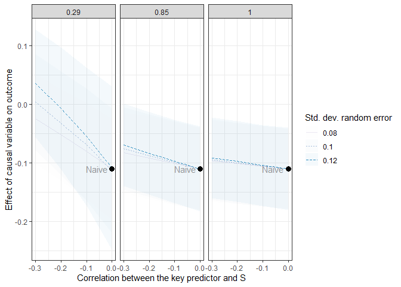
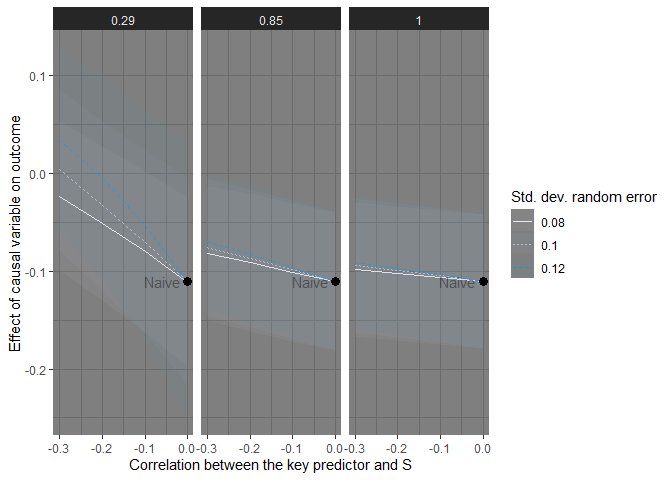

<!-- README.md is generated from README.Rmd. Please edit that file -->

# rcme - Recounting Crime Measurement Error 

<!-- badges: start -->

[](https://zenodo.org/badge/latestdoi/505738456)
<!-- badges: end -->

The goal of the rcme package is to support the sensitivity analysis of
crime data to different types of measurement error. It is result of the
[Recounting Crime Project](https://recountingcrime.com/). You can see
the publications informing this work
[here](https://recountingcrime.com/scientific-articles/).

## Installation

You can install the development version of rcme from
[GitHub](https://github.com/) with:

``` r
# install.packages("devtools")
devtools::install_github("alex-cernat/rcme")
```

## Example

This is a basic example which shows how to get a corrected regression
estimate when we assume measurement error on the independent variable
with a recordig rate (`S`) of 0.31, a standard deviation (`R_sd`) of
0.12 and a correlation between the variable of interest and measurement
error (`D`) of -0.1.

``` r
rcme_ind(
  formula = "disorder ~ log_violent_crime + white_british + unemployment + median_age",
  data = crime_disorder,
  key_predictor = "log_violent_crime",
  S = 0.31,
  R_sd = 0.12,
  D = -0.1) 
#> $sim_result
#>   key_predictor    SE
#> 1         0.006 0.004
#> 
#> $naive
#> 
#> Call:
#> lm(formula = paste0(outcome, " ~ ", paste0(c(paste0(key_predictor, 
#>     collapse = ""), predictors[!predictors %in% key_predictor]), 
#>     collapse = " + ")), data = data)
#> 
#> Coefficients:
#>       (Intercept)  log_violent_crime      white_british       unemployment  
#>          -1.02838            0.39849           -0.08915            0.21015  
#>        median_age  
#>          -0.17004  
#> 
#> 
#> $key_predictor
#> [1] "log_violent_crime"
```

It is possible to run the function over multiple scenarios as well as
enable the function to log the variable of interest:

``` r
rcme_ind(
  formula = "disorder ~ violent_crime + white_british + unemployment + median_age",
  data = crime_disorder,
  key_predictor = "violent_crime",
  S = c(0.31, 0.67, 1.0),
  R_sd = c(0.08, 0.10, 0.12),
  log_var = T) 
#> Warning in rcme_ind(formula = "disorder ~ violent_crime + white_british + unemployment + median_age", : You have specified log_var = TRUE.
#> The crime variable will be logged to reflect the multiplicative error structure. If you wish to report the sensitivity results in the original crime metric they will need to be transformed. For a full discussion of the multiplicative error structure of crime see Pina-Sanchez et al., 2022.
#> Warning in rcme_ind(formula = "disorder ~ violent_crime + white_british +
#> unemployment + median_age", : The correlation between measurement error in
#> crime data and the key variable of interest is set to 0. Non-differentiality is
#> assumed.
#> $sim_result
#>      S R_sd D log_var key_predictor    SE
#> 1 0.31 0.08 0    TRUE         0.236 0.121
#> 2 0.67 0.08 0    TRUE         0.355 0.147
#> 3 1.00 0.08 0    TRUE         0.391 0.154
#> 4 0.31 0.10 0    TRUE         0.164 0.101
#> 5 0.67 0.10 0    TRUE         0.335 0.143
#> 6 1.00 0.10 0    TRUE         0.385 0.153
#> 7 0.31 0.12 0    TRUE         0.103 0.079
#> 8 0.67 0.12 0    TRUE         0.313 0.138
#> 9 1.00 0.12 0    TRUE         0.380 0.152
#> 
#> $naive
#> 
#> Call:
#> lm(formula = paste0(outcome, " ~ ", paste0(c(paste0("log(", key_predictor, 
#>     ")", collapse = ""), predictors[!predictors %in% key_predictor]), 
#>     collapse = " + ")), data = data)
#> 
#> Coefficients:
#>        (Intercept)  log(violent_crime)       white_british        unemployment  
#>           -1.02838             0.39849            -0.08915             0.21015  
#>         median_age  
#>           -0.17004  
#> 
#> 
#> $key_predictor
#> [1] "violent_crime"
```

When measurement error is on the outcome you can use the `rcme_out()`
function:

``` r
rcme_out_ex <- rcme_out(
  formula = "damage_crime ~ collective_efficacy + unemployment + white_british + median_age",
  data = crime_damage,
  key_predictor = "collective_efficacy",
  S = c(0.29, 0.85, 1.0),
  R_sd = c(0.08, 0.10, 0.12),
  D = c(-0.3, -0.2, -0.1, 0),
  log_var = T)
#> Warning in rcme_out(formula = "damage_crime ~ collective_efficacy + unemployment + white_british + median_age", : You have specified log_var = TRUE.
#> The crime variable will be logged to reflect the multiplicative error structure. If you wish to report the sensitivity results in the original crime metric they will need to be transformed. For a full discussion of the multiplicative error structure of crime see Pina-Sanchez et al., 2022.
```

You can also visualize the results of the simulations easily using
`rcme_sim_plot()`:

``` r
rcme_sim_plot(rcme_out_ex, ci = T, naive = T)
```



The result of this function is just a normal `ggplot2` object which can
be changed and saved accordingly:

``` r
rcme_sim_plot(rcme_out_ex, ci = T, naive = T) +
  ggplot2::theme_dark()
```


